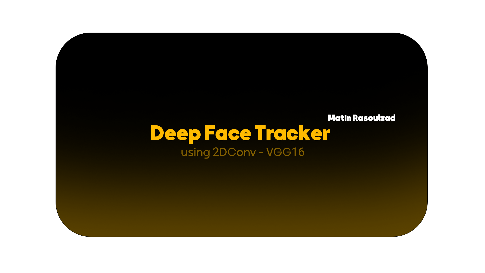
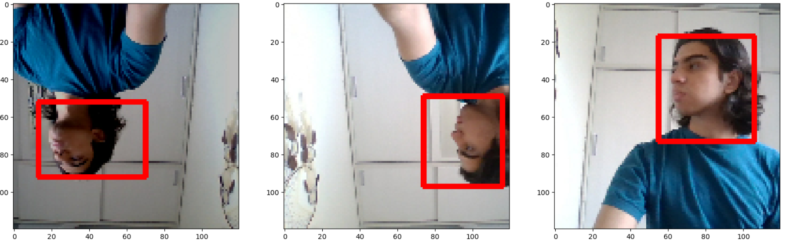

# DeepFace Tracker using Pre-trained VGG16

This project is a personalized deep learning application that uses the VGG16 model to track head movements. By leveraging a pre-trained VGG16 convolutional neural network and fine-tuning it with 90 self-captured images, the model has been customized to recognize and follow the user's unique facial features. This approach ensures precise and reliable tracking tailored specifically to the user's face.  

The primary aim of the project is to monitor and track head movements in real-time, providing a foundation for applications like gesture-based controls, virtual reality, or accessibility tools. By combining the power of pre-trained models with personalization, this project demonstrates the potential of deep learning in creating adaptable and highly accurate tracking systems.   

این پروژه یک مدل یادگیری عمیق شخصی‌سازی‌شده است که حرکات سر را به صورت دقیق دنبال می‌کند. با استفاده از مدل از پیش آموزش‌دیده VGG16 و fine-tune کردن آن با 90 تصویر شخصی، این سیستم به‌طور خاص برای تشخیص چهره و حرکات شما طراحی شده است.

## **🔸Note:** This project is work in progress and indeed not a final model.

